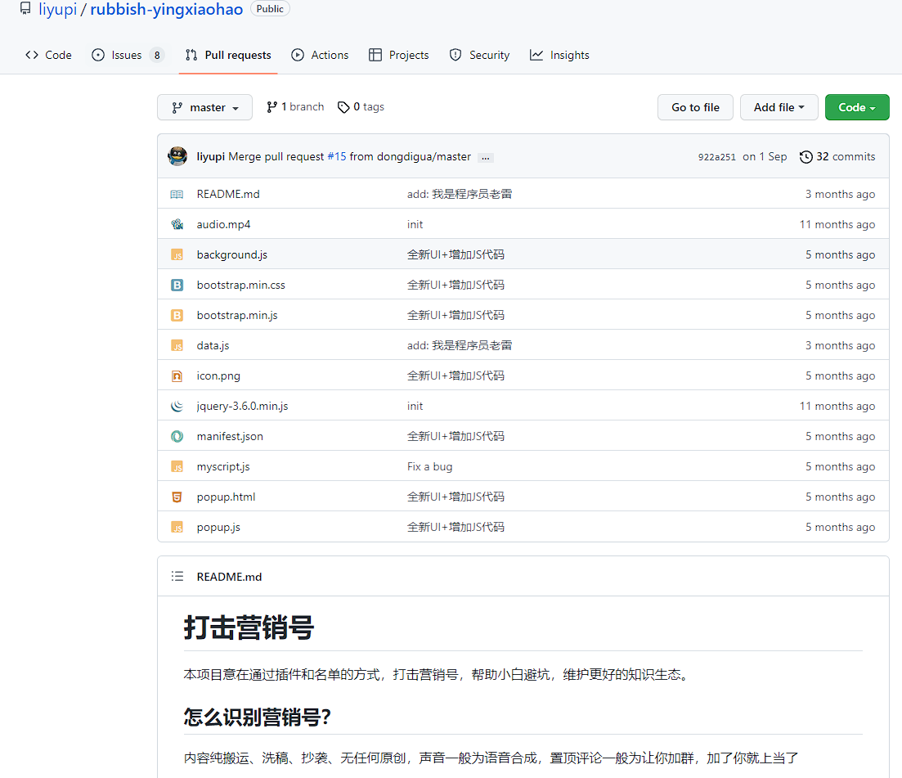
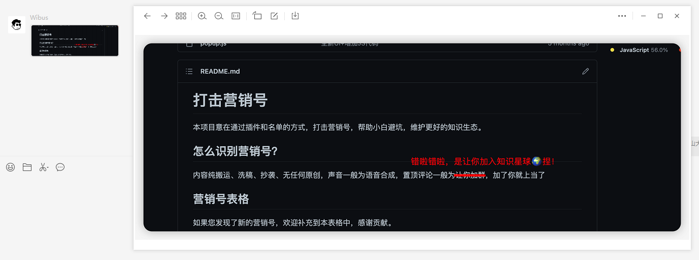
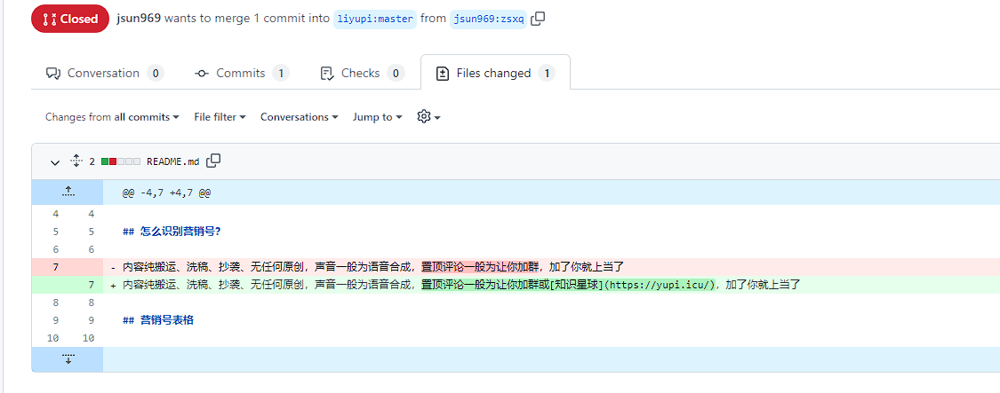
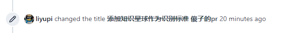
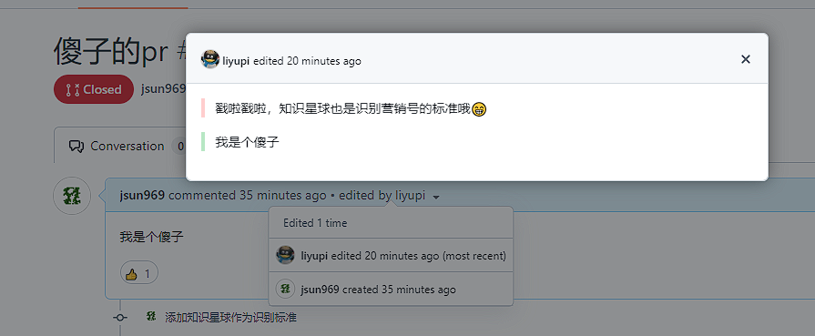
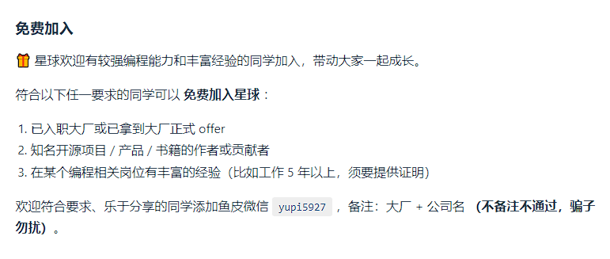
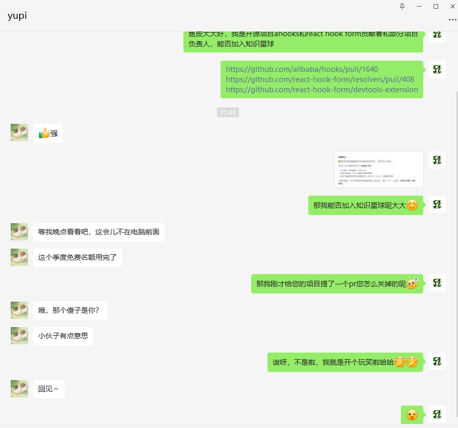
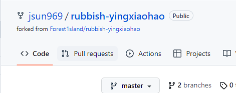
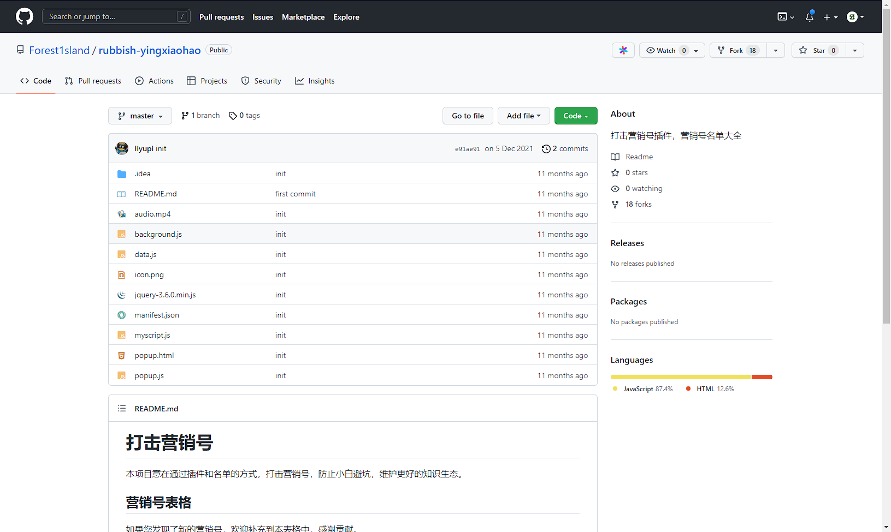

# 看看程序员鱼皮的嘴脸

## 起因

我本人一直都是很反感程序员鱼皮（[Bilibili UP 主](https://space.bilibili.com/12890453)）。首先对于他的编程技术，我不敢恭维；其次通过付费才能加入的[知识星球](https://yupi.icu/)，割了不少韭菜，然而并无实质内容和技术含量。总的来说就是一个骗骗小白的小丑。

具体吐槽可以看我朋友 Wibus 的一篇博文：[关于 B 站“知名”鱼皮 UP 主，我对他的看法 - 秉松博客](https://blog.iucky.cn/posts/says/joker_yupi_up)

我在他 GitHub 上看到一个挺搞笑的库：rubbish-yingxiaohao

Wibus 在群里整活说：

挺有意思，我发个 PR 玩玩

## 发个 PR

> 在文章发出时，此 PR 已被他（或者腾讯）清理，后文会阐述

_忘记截 Open 时候的图了，反正这种非技术 PR，鱼皮处理的倒是挺快的。_

## 是不是玩不起

迷惑操作来了，他把我 PR 的 Title 和 Message 都改掉然后把 PR lock 了（就是除了他无法修改和删除）

这改的，多少有点小学生。。。

他是真的不知道改 PR 是有记录的吗

## 换个思路

既然打不过，那就加入呗。我看到他知识星球好像是可以免费加入的

好吧那我试试（我这里多少有点阴阳怪气了哈哈）

然后他就把我拉黑了。。。

好的吧，没乐子找了，本来打算就此结束了

## 蚌埠住了

我再去看那个 PR 的时候，居然被他删掉了？我找了一下[Fork 的仓库](https://github.com/jsun969/rubbish-yingxiaohao)发现

原仓库被他转移到一个另一个号去了，只留下了他自己的记录。所有社区贡献（包括 PR）都被删了。

大概是怕被发现那个**傻子 PR**有记录吧。~~现在真的有记录了~~

蛮无语的
